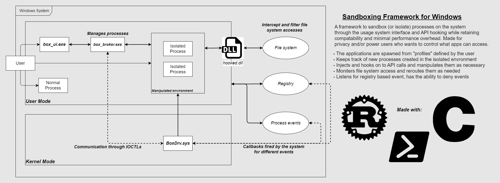

# sandbox-research

This repository contains my study on sandboxing and Windows internals, originally done for an academic research. The driver component of this project can be found here: [aCursedComrade/sandbox-driver](https://github.com/aCursedComrade/sandbox-driver)

## Building the solution

Following are build dependencies required to build the project:

- MS Build Tools and Windows Driver Kit are required to compile the project including the driver. [Read the documentation](https://learn.microsoft.com/en-us/windows-hardware/drivers/download-the-wdk) to setup the environment.
- [Protobuf compiler - `protoc`](https://github.com/protocolbuffers/protobuf?tab=readme-ov-file#protobuf-compiler-installation) used to compile Protobuf source files to be consumed by gRPC servcies.

Once built appropiately, you can run the `bundle.ps1` which simply copies over necessary files into a directory, "TheBox". The directory structure is expected to be as follows:

- TheBox/
	- BoxDrv/
		- BoxDrv.cat
		- BoxDrv.inf
		- BoxDrv.sys
	- utils/
		- hooked.dll
		- whisper.exe
	- box_broker.exe
	- box_ui.exe
	- setup.ps1

## Running the solution

The existence of a private signed (or test signed) driver requires the Windows system to allow test signing and optionally turn on on debug mode for debug logging. Complete documentation for manual driver deployment can be found in [Microsoft Knowledge Base](https://learn.microsoft.com/en-us/windows-hardware/drivers/develop/preparing-a-computer-for-manual-driver-deployment). Or you can simply execute the following in an elevated prompt:

- To enable the `testsigning` feature:
	- `bcdedit /set TESTSIGNING ON`
- Optionally, for debug logs:
	- `bcdedit /set DEBUG ON`

Additionally, the user-mode components also require [Visual C++ Redistributles 2015-2022](https://learn.microsoft.com/en-US/cpp/windows/latest-supported-vc-redist?view=msvc-170) to run. After, you have gone through the dependencies, you can then run the `setup.ps1` script (in an elevated prompt) to setup the services of associated with the broker and the driver.

Finally, you can start interacting with the solution by executing the `box_ui.exe` binary.
